# 电动滑板 FOC 固件 — 算法、公式与程序流程图

> 对应代码版本：YFSkateBoard / SkateBoard / Core（**v4 — 2026-03-30**）  
> MCU：STM32F103CBT6 · 72 MHz · HAL  
> 电机：14极（7对极）轮毂电机，Vbus=24V，KV=270 rpm/V，R_phase=0.10Ω，轮径50mm

---

## 目录

1. [系统整体架构](#1-系统整体架构)
2. [文件依赖关系图](#2-文件依赖关系图)
3. [完整函数调用关系图](#3-完整函数调用关系图)
4. [启动流程 (App_Task_Init)](#4-启动流程-app_task_init)
5. [主控循环 (App_Task_Tick)](#5-主控循环-app_task_tick)
6. [Hall 解码算法](#6-hall-解码算法)
7. [DWT 硬件防抖](#7-dwt-硬件防抖-500-µs)
8. [方向滞后滤波器 (3步迟滞)](#8-方向滞后滤波器-3步迟滞)
9. [电气角估计 (LUT + DWT插值 + offset)](#9-电气角估计-lut--dwt插值--offset)
10. [速度测量 (100ms 窗口)](#10-速度测量-100ms-窗口)
11. [PID 控制器（含抗积分饱和）](#11-pid-控制器含抗积分饱和)
12. [FOC_Run 主管道](#12-foc_run-主管道)
13. [EMI 速度反馈三级滤波](#13-emi-速度反馈三级滤波)
14. [软启动斜坡 (startup_vq_limit)](#14-软启动斜坡-startup_vq_limit)
15. [开环启动（编译开关，默认关闭）](#15-开环启动编译开关默认关闭)
16. [正弦三相输出 (FOC_ApplySinusoidal)](#16-正弦三相输出-foc_applysinusoidal)
17. [Hall Offset 自动标定 (FOC_CalibrateHallOffset)](#17-hall-offset-自动标定-foc_calibratehalloffset)
18. [BLDC 六步换相控制 (motor.c)](#18-bldc-六步换相控制-motorc)
19. [ADC 传感器公式 (adc_sensor.c)](#19-adc-传感器公式-adc_sensorc)
20. [NTP 时间同步算法](#20-ntp-时间同步算法)
21. [Flash 存储与里程/运行时累加](#21-flash-存储与里程运行时累加)
22. [CRC8 校验](#22-crc8-校验)
23. [全部公式汇总表](#23-全部公式汇总表)
24. [关键参数速查表](#24-关键参数速查表)

---

## 1. 系统整体架构

```
┌─────────────────────────────────────────────────────────────────┐
│                        STM32F103CBT6  72 MHz                     │
│                                                                  │
│  HAL_GPIO_EXTI_Callback ────► FOC_NotifyHallTransition           │ ← Hall A/B/C
│      │  (IRQ, EXTI15_10)         DWT 500µs 防抖                  │   PB12/13/14
│      │                                                           │
│      ▼                                                           │
│  Hall_Position()  Hall_directionLoopCheck()                      │
│  FOC_HallPositionAccumulate()                                    │
│      │                                                           │
│  TIM4 1ms ──► APP_time++                                         │
│      ├── 100ms ──► HallSpeed_Timer()                             │
│      │               hall_speed  hall_direction                  │
│      ├── 150ms ──► heartbeat_send_flag = 1                       │
│      ├── 200ms ──► LED_Timer()                                   │
│      ├── 700ms ──► watchdog 升级                                 │
│      └──  60s  ──► Store_runTime()                               │
│                                                                  │
│  main loop ─ App_Task_Tick() ─每1ms─┐                            │
│     │                                ├── FOC_Run() ──► FOC_ApplySinusoidal()
│     │                                │                    ──► TIM3 CCR2/3/4
│     │                                │                        U/V/W 30kHz PWM
│     │                                └── Motor_Control(SetSpeedRC)  (BLDC模式)
│     │                                                            │
│     ├── ADC DMA 连续采样 (PA1电流 PA2电池 PA4备用 PA5温度)         │
│     ├── UART1 (DBG) ◄──── Serial_Printf / FOC诊断               │
│     └── UART3 (NRF) ◄──► RC_unpack / RC_send                    │
└─────────────────────────────────────────────────────────────────┘
```

**定时器分配**

| 定时器 | 功能 | 周期 |
|--------|------|------|
| TIM3 CH2/3/4 | PWM 三相输出 (U=PA7, V=PB0, W=PB1) | 30 kHz (ARR=299) |
| TIM4 | 系统主节拍，TIM4 ISR 内分频各子任务 | 1 ms |
| TIM2 CH1 | LED 调试 PWM | — |
| DWT CYCCNT | 微秒级 Hall 防抖 + 扇区插值时间戳 | 硬件计数器 |
| ADC1 DMA | 4通道循环采样 (电流/电池/备用/NTC) | 连续 |

---

## 2. 文件依赖关系图

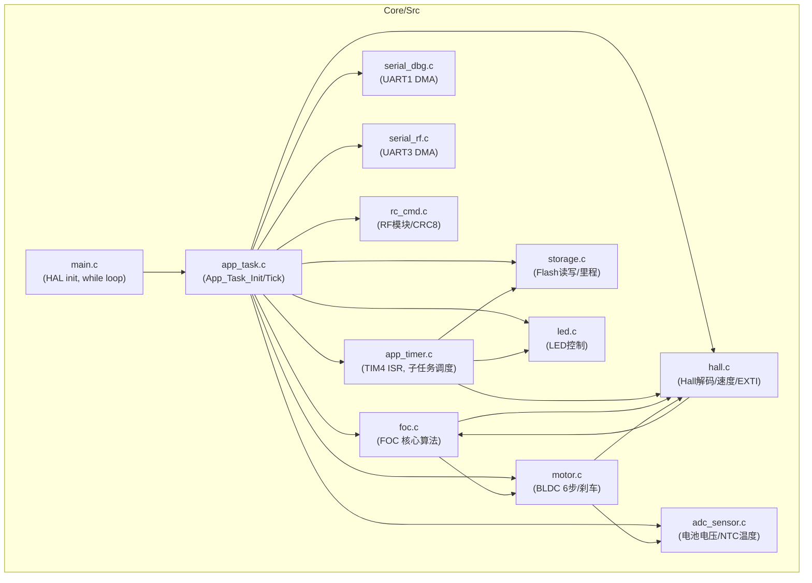

**文件-功能映射**

| 文件 | 关键函数 | 功能 |
|------|---------|------|
| `foc.c` | `FOC_Init` `FOC_Run` `FOC_ApplySinusoidal` `FOC_CalibrateHallOffset` `PID_Compute` `Hall_ComputeAngleDeg` `FOC_NotifyHallTransition` `FOC_HallPositionAccumulate` | FOC 核心：角度估计、PID环、正弦输出、标定 |
| `hall.c` | `Hall_Init` `Hall_Position` `Hall_directionLoopCheck` `Hall_GetSpeed` `HallSpeed_Timer` `HAL_GPIO_EXTI_Callback` | Hall传感器：GPIO解码、方向判断、速度测量 |
| `motor.c` | `Motor_Init` `Motor_Set` `Motor_Control` `Motor_Direction` `BrakeControl` `calculate_min_slip_duty` `setSpeed_filter` | BLDC六步换相、刹车、滑行保护 |
| `app_task.c` | `App_Task_Init` `App_Task_Tick` `RC_unpack` `CMD_foc_control` `CMD_heartbeat` `selfCheck` | 主控逻辑、遥控解包、系统状态管理 |
| `app_timer.c` | `AppTimer_Init` `HAL_TIM_PeriodElapsedCallback` | 1ms定时器ISR、子任务分频调度 |
| `adc_sensor.c` | `ADC_Sensor_Init` `ADC_GetBatteryVoltage` `ADC_GetTemperature` | ADC采样、电压/温度转换 |
| `storage.c` | `Store_Init` `Store_Save` `Store_Mileage` `Store_runTime` `Flash_ErasePage` | Flash持久化、里程/运行时间累加 |
| `rc_cmd.c` | `RC_setSysInit` `RC_send` `Calculate_CRC8` | NRF模块初始化、数据打包、CRC校验 |
| `serial_dbg.c` | `Serial_Init` `Serial_Printf` `Serial_IDLE_Handler` | UART1 DMA调试串口 |
| `serial_rf.c` | `Serial_RF_Init` `Serial_RF_SendArray` `Serial_RF_IDLE_Handler` | UART3 DMA无线通信 |

---

## 3. 完整函数调用关系图

### 3.1 中断调用链

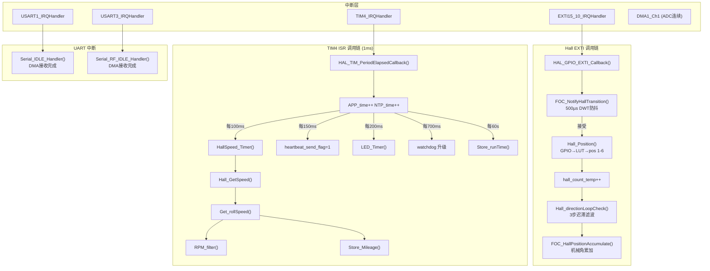

### 3.2 主循环调用链

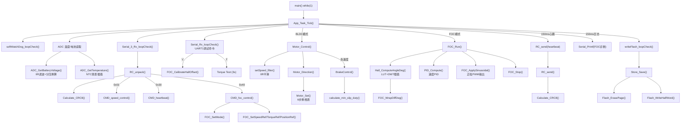

### 3.3 标定流程调用链

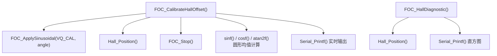

---

## 4. 启动流程 (App_Task_Init)

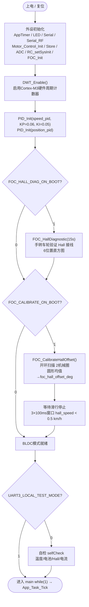

**初始化调用链**

```
App_Task_Init()
├── AppTimer_Init()          → HAL_TIM_Base_Start_IT(TIM4)
├── LED_Init()
├── Serial_Init()            → DMA RX + IDLE中断 (UART1)
├── Serial_RF_Init()         → DMA RX + IDLE中断 (UART3)
├── Motor_Control_Init()
│   ├── Motor_Init()         → SD GPIO初始化, TIM3 PWM启动
│   └── Hall_Init()          → PB12/13/14 EXTI 双边沿
├── Store_Init()             → Flash→RAM镜像 (magic=0x1218)
├── ADC_Sensor_Init()        → HAL_ADCEx_Calibration_Start + DMA连续采样
├── RC_setSysInit()          → NRF模块PD/SET引脚
├── FOC_Init()               → DWT_Enable + PID_Init × 2
├── [FOC_HallDiagnostic()]   → 条件编译
├── [FOC_CalibrateHallOffset()] → 条件编译
└── [selfCheck()]            → 条件编译
```

---

## 5. 主控循环 (App_Task_Tick)

> 由 main while(1) 循环调用，约 1 ms/次

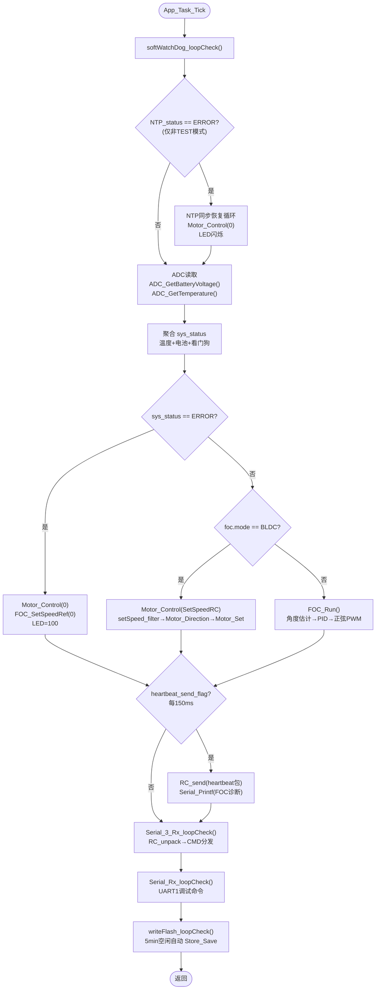

---

## 6. Hall 解码算法

### 6.1 引脚映射（硬件接线）

```
物理引脚  →  逻辑相
PB12 (HallA)  →  V 相
PB13 (HallB)  →  W 相
PB14 (HallC)  →  U 相
```

### 6.2 位置解码 LUT

**公式**：读取 GPIO 位组合 → 查表得 `position` 1-6

| U(HallC) | V(HallA) | W(HallB) | position |
|----------|----------|----------|----------|
| 0 | 1 | 0 | 1 |
| 0 | 1 | 1 | 2 |
| 0 | 0 | 1 | 3 |
| 1 | 0 | 1 | 4 |
| 1 | 0 | 0 | 5 |
| 1 | 1 | 0 | 6 |

### 6.3 正向旋转序列（CW 方向）

```
正转（前进）：pos 5 → 4 → 3 → 2 → 1 → 6 → 5 → ...（位置值递减，DIRECTION = -1）
反转（刹车）：pos 1 → 2 → 3 → 4 → 5 → 6 → 1 → ...
```

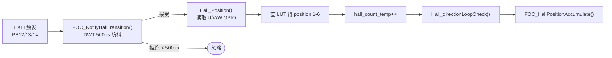

---

## 7. DWT 硬件防抖 (500 µs)

**目的**：隔离启动冲击电流感应的假 Hall 边沿（约 100–450 µs 间隔）

**公式**：

$$\text{DWT\_Micros()} = \frac{\text{DWT→CYCCNT}}{\text{SystemCoreClock} / 10^6} \quad [\mu s]$$

```
FOC_NotifyHallTransition():
    now   = DWT_Micros()
    dur   = now - s_trans_us
    
    if dur < 500:          ← 拒绝（EMI 噪声典型间隔 100–449 µs）
        return 0
    
    s_sector_dur_us = dur  ← 记录真实扇区持续时间（用于角度插值）
    s_trans_us      = now
    return 1               ← 接受
```

**临界计算**：500 µs 对应最高可通过速度：

$$v_{max} = \frac{1}{500 \times 10^{-6} \times N_{trans/rev}} \times \pi \times D_{wheel} \times 3.6$$

$$= \frac{1}{500\mu s \times 42} \times \pi \times 0.05 \times 3.6 \approx 27 \text{ km/h} \quad \text{(> USER\_MAX\_SPEED 25 km/h，足够余量)}$$

---

## 8. 方向滞后滤波器 (3步迟滞)

**目的**：防止单次 EMI 噪声翻转方向判断

**公式**：

$$\text{movement} = -(\text{current\_pos} - \text{prev\_pos})$$

跨界修正：$+5 \rightarrow -1$，$-5 \rightarrow +1$

$$\text{hall\_direction} = \text{s\_pending} \times \text{DIRECTION}$$

```
Hall_directionLoopCheck():
    movement = -(current_pos - prev_pos)   ← 负号：pos渐减=正转
    
    if movement == +5: movement = -1        ← 6→1 跨界修正
    if movement == -5: movement = +1        ← 1→6 跨界修正
    
    if movement ∉ {+1, -1}: return         ← 非法跳变，忽略
    
    if movement == s_pending:
        s_pending_cnt++
    else:
        s_pending     = movement
        s_pending_cnt = 1
    
    if s_pending_cnt >= 3:
        hall_direction = s_pending × DIRECTION   ← 更新（含电机方向修正）
```

**FOC_HallPositionAccumulate** — 机械角累加：

$$\Delta\theta_{mech} = \frac{60°}{P_{poles}} = \frac{60°}{7} \approx 8.57° \text{ / 电气扇区}$$

```
step = 60.0 / FOC_POLE_PAIRS
if hall_direction > 0: s_pos_accum_deg += step
if hall_direction < 0: s_pos_accum_deg -= step
```

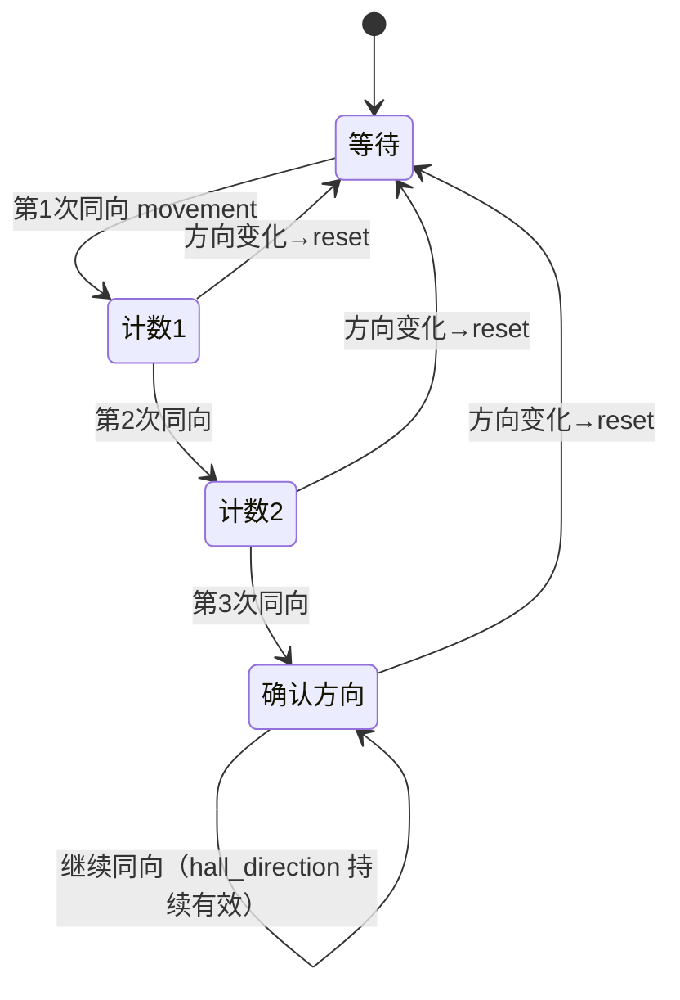

---

## 9. 电气角估计 (LUT + DWT插值 + offset)

> **v4 重大更新**：新增 DWT 扇区内插值（旧版本不使用插值），新增 500ms 静止检测避免冷启动堵转。

### 9.1 扇区基础角度 LUT（已重新标定）

| position | LUT 名义角度 | 说明 |
|----------|-------------|------|
| 1 | 60°  | |
| 2 | 0°   | |
| 3 | 300° | |
| 4 | 240° | |
| 5 | 180° | |
| 6 | 120° | |

> **对比v1**：旧 LUT = {150, 120, 60, 330, 300, 270}°，新 LUT = {60, 0, 300, 240, 180, 120}°。  
> 通过 FOC_CalibrateHallOffset 重新测量后更新，并在运行时加 `foc_hall_offset_deg` 微调。

### 9.2 角度计算公式（含 DWT 插值）

**基础角**：

$$\theta_{base} = k\_sector\_base[pos] + \delta_{offset}$$

**下一扇区角**（根据旋转方向）：

$$\theta_{next} = k\_sector\_base[\text{next\_pos}] + \delta_{offset}$$

- 正转（`hall_direction > 0`，pos 递减）：`next_pos = (pos == 1) ? 6 : pos - 1`
- 反转（`hall_direction < 0`，pos 递增）：`next_pos = (pos == 6) ? 1 : pos + 1`

**扇区跨度**（最短弧）：

$$\text{span} = \text{WrapDiffDeg}(\theta_{next}, \theta_{base})$$

$$\text{WrapDiffDeg}(a, b) = \begin{cases} a-b - 360 & \text{if } a-b > 180 \\ a-b + 360 & \text{if } a-b < -180 \\ a-b & \text{otherwise} \end{cases}$$

**DWT 插值分数**：

$$\text{frac} = \begin{cases} 0 & \text{if elapsed} > 500\text{ms（电机静止，不外推）} \\ \min\left(\frac{\text{elapsed\_us}}{\text{s\_sector\_dur\_us}},\ 1.0\right) & \text{otherwise} \end{cases}$$

> **冷启动修复（v4）**：标定结束后 `s_sector_dur_us` 残留很小值（~5000µs），若不加静止检测，50ms 后 frac 钳位至 1.0，角度外推到下扇区边界（+60°），加上 Q-axis +90° = 150° 偏移，cos(150°) = -0.87 产生制动力矩。设 500ms 阈值，电机停止时 frac=0，停在扇区基础角，最差误差 30°，cos(30°) = 0.87 仍有 87% 扭矩效率。

**最终角度**：

$$\theta_{elec} = (\theta_{base} + \text{span} \times \text{frac}) \mod 360°$$

### 9.3 流程图

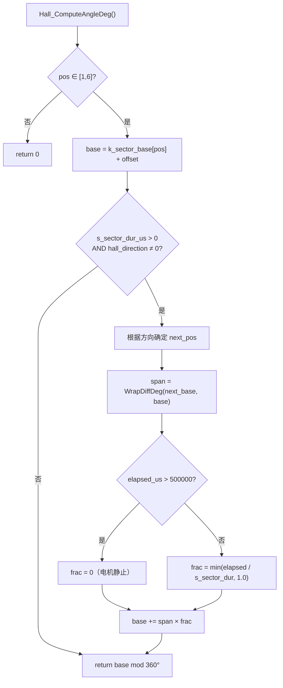

---

## 10. 速度测量 (100ms 窗口)

### 10.1 主流程

```
HallSpeed_Timer()  [每100ms由TIM4 ISR触发]:
    hall_count      = hall_count_temp   ← 快照
    hall_count_temp = 0                 ← 清零
    Hall_GetSpeed()                     ← 计算 hall_speed
    
    if hall_count <= 1:
        s_stop_cnt++
        if s_stop_cnt >= 3:
            hall_speed = 0.0           ← 3窗口连续 ≤1次才清零
    else:
        s_stop_cnt = 0
```

### 10.2 转速计算公式

**Get_rollSpeed()** — 转/秒：

$$v_{rev/s} = \frac{N_{count}}{N_{trans/rev} \times T_{window}}$$

**IIR 低通滤波**（RPM_filter）：

$$v_{filtered}[k] = \alpha \cdot v_{raw}[k] + (1-\alpha) \cdot v_{filtered}[k-1], \quad \alpha = 0.2$$

**Hall_GetSpeed()** — km/h 转换：

$$v_{km/h} = v_{filtered,\ rev/s} \times \pi \times D_{mm} \times \frac{3.6}{1000}$$

其中：
- $N_{count}$：100ms 窗口内 Hall 有效边沿计数
- $N_{trans/rev} = 6 \times P_{poles} = 6 \times 7 = 42$
- $T_{window} = 0.1 \text{ s}$
- $D_{mm} = 50 \text{ mm}$

**最低可测速（1次边沿/窗口）**：

$$v_{min} = \frac{1}{42 \times 0.1} \times \pi \times 0.05 \times 3.6 \approx 0.13 \text{ km/h}$$

### 10.3 里程累加公式

**Get_rollSpeed()** 内同步累加里程：

$$\text{每次边沿距离} = \frac{\pi \times 90\text{mm}}{42} \approx 6.731 \text{ mm}$$

$$149 \text{ 次边沿} \approx 1 \text{ m}$$

```
当 mileage_count >= 149:
    meter = 0.006731 × mileage_count + decimal
    Store_Mileage(整数米数)
    decimal = 小数余量
```

> 注：里程使用轮径 90mm（外径含轮胎），FOC速度使用 50mm（轮毂直径）。

---

## 11. PID 控制器（含抗积分饱和）

### 11.1 标准 PID + 抗饱和

```
PID_Compute(pid, setpoint, feedback, dt):
    error = setpoint - feedback
    
    // 积分项
    pid.integral += error × dt
    clamp(pid.integral, ±ILIM)
    
    // 微分项
    derivative = (dt > 1e-6) ? (error - pid.prev_error) / dt : 0
    pid.prev_error = error
    
    // 输出
    out = Kp×error + Ki×integral + Kd×derivative
    
    // 抗积分饱和（向后取消）
    if (out > OLIM AND error > 0) OR (out < -OLIM AND error < 0):
        pid.integral -= error × dt   ← 撤回本步积分
    
    clamp(out, ±OLIM)
    return out
```

**连续域形式**：

$$u(t) = K_p \cdot e(t) + K_i \int_0^t e(\tau)d\tau + K_d \frac{de}{dt}$$

**离散域实现**：

$$u[k] = K_p \cdot e[k] + K_i \cdot I[k] + K_d \cdot \frac{e[k] - e[k-1]}{\Delta t}$$

$$I[k] = \text{clamp}\!\left(I[k-1] + e[k] \cdot \Delta t,\ \pm I_{lim}\right)$$

**抗饱和逻辑**：当输出已饱和且误差方向继续推向饱和时，撤销本次积分累加，避免积分项"超调锁死"数秒。

### 11.2 速度环参数（v4 当前值）

| 参数 | 值 | 含义 |
|------|----|------|
| `KP` | **0.06** | 比例增益（用户确认>0.06会因EMI导致堵转） |
| `KI` | 0.05 | 积分增益（从0.02提高，加速低速启动积分爬升） |
| `KD` | **0.000** | 微分增益（Hall 100ms更新太慢，D项必须为0） |
| `ILIM` | **40.0** | 积分上限（开放，允许高速反电动势下积分爬升） |
| `OLIM` | 0.80 | 输出上限（Vq，归一化） |

### 11.3 位置环参数

| 参数 | 值 | 含义 |
|------|----|------|
| `KP` | 0.05 | 比例增益 |
| `KI` | 0.001 | 积分增益 |
| `KD` | 0.002 | 微分增益 |
| `ILIM` | 20.0 | km/h 积分限制 |
| `OLIM` | 20.0 | km/h 最大速度指令 |

### 11.4 速度环静态设计点

```
ref=2 km/h，电机卡死（误差=+2 km/h）：
  P-term  = 0.06 × 2    = +0.12 Vq
  I-term（1秒后） = 0.05 × 2.0 × 1.0 = +0.10 Vq
  Total ≈ 0.22 Vq → 足够克服静摩擦

ref=7 km/h 稳态（误差≈0）：
  P-term ≈ 0
  I-term 稳态 ≈ Vq_needed (BEMF补偿)
  KI × I = vq_steady → I = vq / KI
```

---

## 12. FOC_Run 主管道

> 每 1 ms 主循环调用一次（非 BLDC 模式时）
>
> **v4 变更**：OL 启动逻辑已移除（`FOC_USE_OPEN_LOOP=0`），纯闭环驱动。Q-axis +π/2 偏移在 FOC_Run 内施加（不在 FOC_ApplySinusoidal 内）。

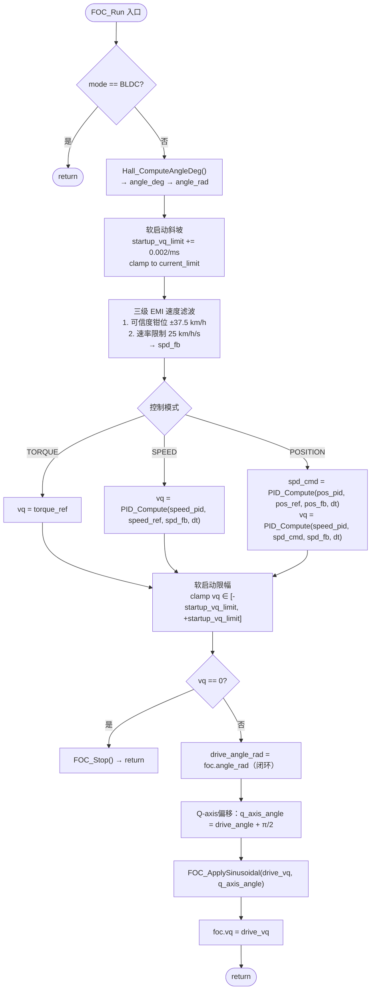

**关键公式**：

$$\text{dt} = (\text{now\_ms} - \text{last\_ms}) \times 0.001 \quad [s]$$

$$\text{angle\_rad} = \text{angle\_deg} \times \frac{\pi}{180}$$

$$\text{q\_axis\_angle} = \text{drive\_angle\_rad} + \frac{\pi}{2}$$

> Q-axis 偏移 +π/2 确保电流矢量与转子磁场正交（最大扭矩角 = 90°电气角）。

---

## 13. EMI 速度反馈三级滤波

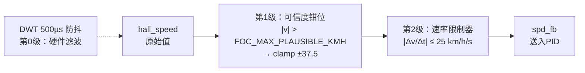

**计算公式**：

$$\text{FOC\_MAX\_PLAUSIBLE\_KMH} = \text{USER\_MAX\_SPEED\_KMH} \times 1.5 = 25 \times 1.5 = 37.5 \text{ km/h}$$

$$\text{FOC\_SPEED\_RATE\_LIMIT\_KMHS} = \text{USER\_MAX\_SPEED\_KMH} \times 1.0 = 25 \text{ km/h/s}$$

**速率限制算法**：

```
max_delta = FOC_SPEED_RATE_LIMIT_KMHS × dt  [km/h]

if   (spd_clamped - s_spd_fb_filt) >  max_delta: s_spd_fb_filt += max_delta
elif (spd_clamped - s_spd_fb_filt) < -max_delta: s_spd_fb_filt -= max_delta
else:                                              s_spd_fb_filt  = spd_clamped
```

**设计依据**：真实滑板最大制动减速约 25 km/h/s，超过此值的速度突变均为 EMI 噪声。

---

## 14. 软启动斜坡 (startup_vq_limit)

**目的**：每次模式切换后从 0 平滑爬升到额定电流限制，避免冷启动时角度不确定导致的电流尖峰。

**公式**：

$$\text{startup\_vq\_limit}[k+1] = \min\!\left(\text{startup\_vq\_limit}[k] + 0.002,\ \text{current\_limit}\right)$$

```
0 → 0.8 需要 400 ms（0.002 / ms × 400 ms = 0.8）
```

```
时间 (ms):   0   100  200  300  400
vq_limit:   0.0  0.2  0.4  0.6  0.8
```

**重置条件**：`FOC_SetMode()` 任何模式切换时 `startup_vq_limit = 0.0`，同时清零 `s_spd_fb_filt`、`PID_Reset()`。

---

## 15. 开环启动（编译开关，默认关闭）

> **v4 变更**：开环逻辑由编译开关 `FOC_USE_OPEN_LOOP`（app_config.h）控制，默认 = 0（关闭）。  
> Hall 标定完成且电机正常启动后，纯闭环模式运行更可靠。  
> 开环仅保留用于 Hall 诊断或齿槽力矩特别大的场景。

### 15.1 开环扫描（FOC_USE_OPEN_LOOP = 1 时激活）

```c
#if FOC_USE_OPEN_LOOP
    static float ol_angle_deg = 0.0f;
    float step = fabsf(drive_vq) * FOC_OL_DEG_PER_MS * (dt * 1000.0f);
    if (drive_vq < 0.0f) step = -step;
    ol_angle_deg += step;
    drive_angle_rad = ol_angle_deg × π/180;
    foc.ol_active = 1;
#else
    drive_angle_rad = foc.angle_rad;   // 纯闭环
    foc.ol_active = 0;
#endif
```

**OL 扫描速率公式**：

$$\dot{\theta}_{OL} = |V_q| \times \text{FOC\_OL\_DEG\_PER\_MS} \times \Delta t_{ms} \quad [°/tick]$$

**OL 相关参数**（仅 FOC_USE_OPEN_LOOP=1 时使用）：

| 参数 | 值 | 说明 |
|------|----|------|
| `FOC_OL_DEG_PER_MS` | 2.0 | el-deg/ms/Vq |
| `FOC_OL_EXIT_SPEED_KMH` | 1.5 | 退出速度 |
| `FOC_OL_EXIT_MIN_HALL_COUNT` | 4 | 最少Hall计数 |
| `FOC_OL_EXIT_HOLD_MS` | 120 | 锁定保持 |
| `FOC_OL_LOCK_MAX_ERR_DEG` | 45° | 最大角度误差 |
| `FOC_OL_ABORT_SPEED_KMH` | 10.0 | 超速中止 |

---

## 16. 正弦三相输出 (FOC_ApplySinusoidal)

### 16.1 三相电压公式

> **v4 变更**：Q-axis 偏移 +π/2 已移到调用方 `FOC_Run()` 中施加。  
> `FOC_ApplySinusoidal()` 接收的 `angle_rad` 已包含Q-axis偏移。  
> 旧版的 `eff_angle = 2π - angle_rad` 方向翻转已移除。

$$V_U = V_q \cdot \sin(\theta_{q})$$
$$V_V = V_q \cdot \sin\!\left(\theta_{q} - \frac{2\pi}{3}\right)$$
$$V_W = V_q \cdot \sin\!\left(\theta_{q} + \frac{2\pi}{3}\right)$$

其中 $\theta_q = \theta_{elec} + \frac{\pi}{2}$（由 FOC_Run 传入）

**归一化到 TIM3 CCR**：

$$CCR = \left\lfloor\left(0.5 + 0.5 \cdot V_{phase}\right) \times 299\right\rfloor$$

$V_{phase} \in [-1, +1]$，$CCR \in [0, 299]$

**50% 中点偏置**说明：$V_{phase}=0$ 时 $CCR=150$（50% 占空比），三相桥中点电压均为 $V_{bus}/2$，电机无电流。

### 16.2 PWM 端口映射

| 相 | TIM3 通道 | 引脚 | 低侧 SD GPIO |
|----|----------|------|-------------|
| U  | CH2 (CCR2) | PA7 | PA6 (MOTOR_UL) |
| V  | CH3 (CCR3) | PB0 | PB7 (MOTOR_VL) |
| W  | CH4 (CCR4) | PB1 | PB8 (MOTOR_WL) |

### 16.3 流程

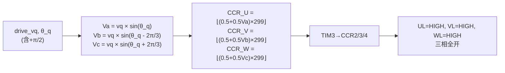

**FOC_Stop()** — 切断输出：
```
TIM3→CCR2/3/4 = 0
UL/VL/WL = LOW（禁用低侧 SD）
```

---

## 17. Hall Offset 自动标定 (FOC_CalibrateHallOffset)

### 17.1 算法概述

开环强制等速扫描 $N$ 个机械转（默认2圈），对每个 Hall 位置连续采样"当前驱动角"，用**圆形均值**求中心角，与 LUT 名义值比较得到偏差，再对所有有效扇区做圆形均值得全局 offset。

### 17.2 方向处理

```c
// MOTOR_DIRECTION == -1 时，正 drive_angle 产生反向旋转
// 标定时需要正向物理旋转，因此翻转角度：
float drive_angle = (MOTOR_DIRECTION == 1) ? angle : (360.0f - angle);
```

### 17.3 主流程

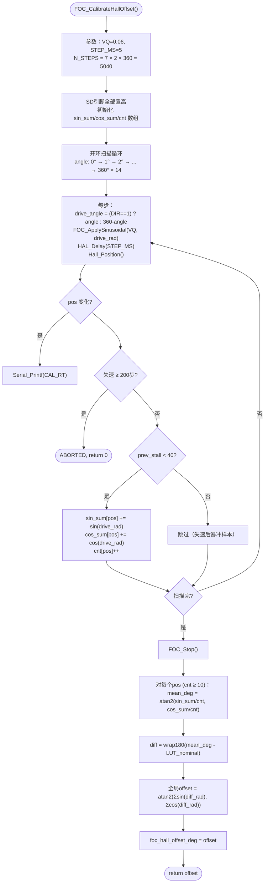

### 17.4 圆形均值公式

避免 0°/360° 跨界平均错误：

$$\bar{\theta} = \text{atan2}\!\left(\frac{1}{N}\sum_{i=1}^{N}\sin\theta_i,\; \frac{1}{N}\sum_{i=1}^{N}\cos\theta_i\right)$$

### 17.5 样本质量过滤

| 条件 | 含义 |
|------|------|
| `stall_counter < 30` | 当前扇区电机正在运动、采样有效 |
| `prev_stall < 40` | 上一扇区未出现长失速后暴冲 |
| `cnt[pos] >= FOC_CAL_MIN_SAMPLES(10)` | 至少10个有效样本才纳入全局均值 |

### 17.6 标定参数

| 参数 | 值 | 含义 |
|------|----|------|
| `FOC_CAL_VQ` | 0.06 | 标定时Vq电压 |
| `FOC_CAL_STEP_MS` | 5 | 每步延迟 ms |
| `FOC_CAL_MECH_REVS` | 2 | 扫描机械圈数 |
| `FOC_CAL_MIN_SAMPLES` | 10 | 每扇区最少样本 |
| **总步数** | 5040 | 7 × 2 × 360 |
| **总时间** | ~25s | 5040 × 5ms |

---

## 18. BLDC 六步换相控制 (motor.c)

### 18.1 换相表

`Motor_Set(position)` — 根据 Hall 位置直接驱动对应上下桥臂：

| case | 上桥导通 | 下桥导通 | TIM3 PWM | SD GPIO |
|------|---------|---------|----------|---------|
| 1 | UH | WL | CCR2=Speed | UL=1 VL=0 WL=1 |
| 2 | VH | WL | CCR3=Speed | UL=0 VL=1 WL=1 |
| 3 | VH | UL | CCR3=Speed | UL=1 VL=1 WL=0 |
| 4 | WH | UL | CCR4=Speed | UL=1 VL=0 WL=1 |
| 5 | WH | VL | CCR4=Speed | UL=0 VL=1 WL=1 |
| 6 | UH | VL | CCR2=Speed | UL=1 VL=1 WL=0 |

### 18.2 Motor_Direction 映射公式

```c
// Forward (direction == -1, 即 MOTOR_DIRECTION):
mapped_pos = 3 - pos;       // 结果 wrap 到 [1,6]
// Reverse (direction == +1):
mapped_pos = 6 - pos;       // 结果 wrap 到 [1,6]
```

### 18.3 速度 IIR 滤波 (setSpeed_filter)

**输入缩放**：

$$\text{input\_scaled} = \text{inputSpeed} \times \frac{ARR+1}{100} = \text{inputSpeed} \times 3$$

**正常平滑**：

$$y[k] = \alpha \cdot x[k] + (1-\alpha) \cdot y[k-1], \quad \alpha = 0.005$$

**滑行模式**（`isCoasting=1`）：

$$y[k] = (100\alpha) \cdot x[k] + (1-100\alpha) \cdot y[k-1], \quad 100\alpha = 0.5$$

**零速减速**（`input=0`）：

$$y[k] = (10\alpha) \cdot x[k] + (1-10\alpha) \cdot y[k-1], \quad 10\alpha = 0.05$$

### 18.4 反电动势最低占空比 (calculate_min_slip_duty)

**目的**：使 PWM 占空比产生的有效电压高于反电动势（BEMF），避免电机失步滑行。

$$\omega = \text{hall\_roll\_speed} \times 60 \times \frac{2\pi}{60} \quad [rad/s]$$

$$V_{BEMF} = K_E \times \omega \quad [V]$$

$$\text{duty} = \frac{V_{BEMF} + \Delta V}{V_{bus}}$$

$$CCR_{min} = \left\lfloor \text{duty} \times 100 + 0.5 \right\rfloor \times \frac{ARR+1}{100}$$

其中 $K_E = 0.130$ V·s/rad，$\Delta V = 0.1$ V（裕量）。

### 18.5 刹车控制 (BrakeControl)

**防反转刹车**带方向消抖：

$$\text{brake\_CCR} = CCR_{min\_slip} - \frac{|\text{set\_speed}|}{2}$$

$$\text{clamp}(\text{brake\_CCR}, 1, ARR)$$

`counter` 在 `hall_direction == -1`（向后）时递增，达到 `MOTOR_BRAKE_DEBOUNCE(5)` 后禁止输出。

### 18.6 Motor_Control 总流程

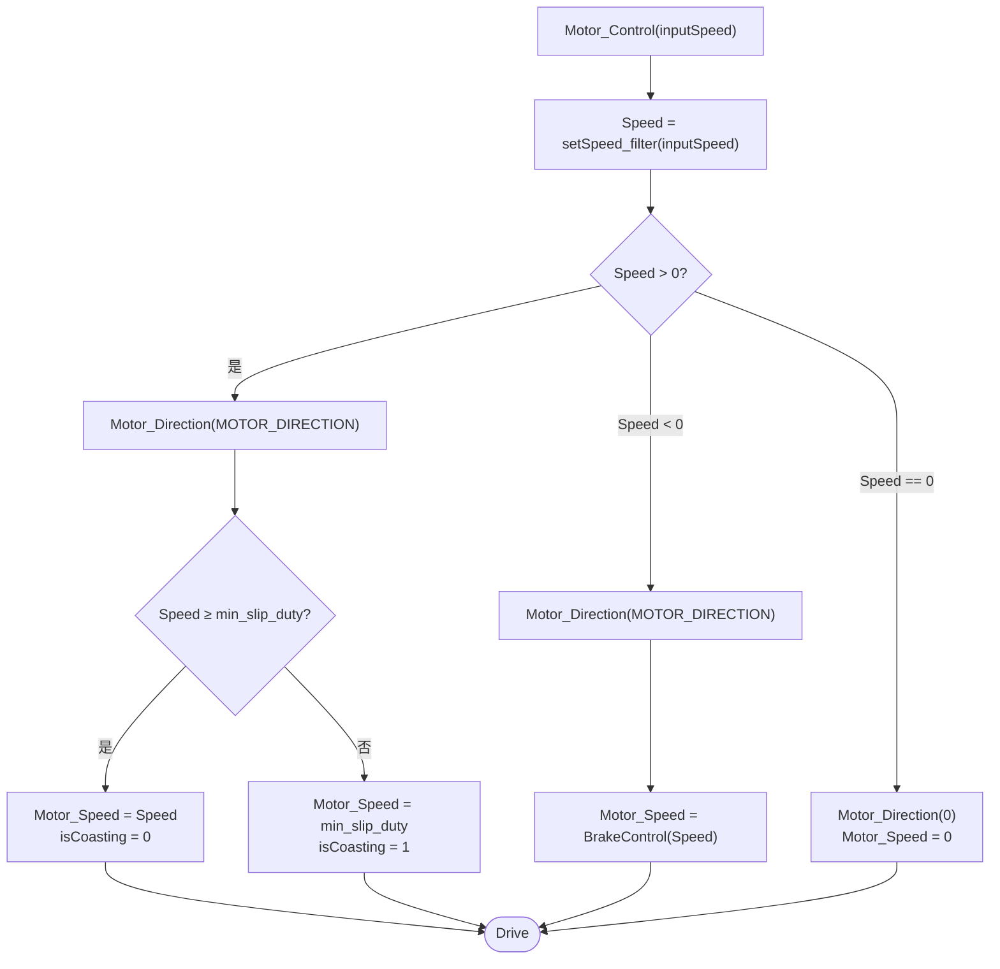

---

## 19. ADC 传感器公式 (adc_sensor.c)

### 19.1 ADC 通道映射

| 通道 | 引脚 | 功能 | adc_values[] |
|------|------|------|-------------|
| CH1 | PA1 | 电机电流 / AGND基准 | [0] |
| CH2 | PA2 | 电池分压 | [1] |
| CH4 | PA4 | 备用 | [2] |
| CH5 | PA5 | NTC 温度 | [3] |

### 19.2 电池电压转换公式

**IIR 电池滤波**：

$$V_{bat,filt}[k] = 0.5 \times V_{raw}[k] + 0.5 \times V_{bat,filt}[k-1]$$

**ADC→电压**：

$$V_{adc} = \frac{\text{adc\_values[1]}_{filt}}{4096} \times 3.3 \quad [V]$$

**分压还原**：

$$V_{bat} = V_{adc} \times \frac{1005.1}{15 \times 5.1} + 0.45 \quad [V]$$

> 分压器：$R_{top} = 15\text{k}\Omega$，$R_{bot} = 5.1\text{k}\Omega$，实际比 = $\frac{R_{top}+R_{bot}}{R_{bot}} = \frac{1005.1}{5.1}$

### 19.3 NTC 温度转换公式

**NTC 电路**：$V_{cc}$ → $220\text{k}\Omega$ 串联 → NTC → GND，PA5 读中点

$$R_{NTC} = \frac{220\text{k}\Omega}{\frac{3.3}{V_{adc}} - 1} \quad [k\Omega]$$

$$V_{adc} = \frac{\text{adc\_values[3]}}{4096} \times 3.3$$

**温度查表**：在 0~120°C 查表（1°C 步距，121 条），线性插值：

$$T = T_i + (T_{i+1} - T_i) \times \frac{R_{NTC} - R_{avg,i}}{R_{avg,i+1} - R_{avg,i}}$$

---

## 20. NTP 时间同步算法

### 20.1 NTP 四时间戳

```
遥控器 → 电调板：
  t1 = 发送时刻（遥控器时钟）
  t2 = 接收时刻（电调板时钟）
  t3 = 回复发送时刻（电调板时钟）
  t4 = 回复接收时刻（遥控器时钟）
```

### 20.2 计算公式

**往返延迟**：

$$\text{delay} = (t_4 - t_1) - (t_3 - t_2)$$

**时钟偏移**：

$$\text{offset} = \frac{(t_2 - t_1) + (t_3 - t_4)}{2}$$

### 20.3 同步策略

- 需要 3 次连续有效同步（delay < 150ms 且 > 0）
- 3 次偏移的极差 < 50ms 才接受
- 校正：`NTP_time += offset[2]`（原子操作，关中断保护）
- 校正后验证：修正值与 $t_3$ 的偏差 < 100ms 才最终接受

---

## 21. Flash 存储与里程/运行时累加

### 21.1 存储布局

Flash 地址：`0x0800FC00`（64KB 设备最后 1KB 页）

| 偏移 | 内容 | 类型 |
|------|------|------|
| [0] | Magic = 0x1218 | uint16 |
| [1-4] | "Mile" 标签 | char |
| [5] | 米数 (0-999) | uint16 |
| [7] | 公里数 (0-999) | uint16 |
| [9] | 千公里数 | uint16 |
| [16] | 千小时 | uint16 |
| [17] | 小时 | uint16 |
| [19] | 分钟 | uint16 |

### 21.2 里程累加公式

```
Store_Mileage(plus_meters):
    meters += plus_meters
    if meters >= 1000: km += 1; meters -= 1000
    if km >= 1000: kkm += 1; km -= 1000
```

### 21.3 运行时累加公式

```
Store_runTime(plus_minutes):   // 每60秒调用一次
    minutes += plus_minutes
    if minutes >= 60: hours += 1; minutes -= 60
    if hours >= 1000: khours += 1; hours -= 1000
```

### 21.4 Flash 操作

- **写入**：`HAL_FLASH_Program(HALFWORD, addr, data)` 关中断保护
- **擦除**：`HAL_FLASHEx_Erase` 整页 1KB，耗时 ~20ms，通过 TIM4 计数器补偿 APP_time
- **定时保存**：5 分钟无速度且无指令时自动 `Store_Save()`

---

## 22. CRC8 校验

**用途**：NRF 无线通信包完整性校验

**公式**：标准 CRC-8，多项式 = 0x07（$x^8 + x^2 + x + 1$）

$$CRC = \text{Calculate\_CRC8}(\text{data}, \text{length})$$

**验证**：接收包尾部 CRC8 与本地计算比较，不等则丢弃。

---

## 23. 全部公式汇总表

### 23.1 按文件分类

| 文件 | 函数 | 公式 | 说明 |
|------|------|------|------|
| **foc.c** | `DWT_Micros()` | $t_{\mu s} = \frac{CYCCNT}{f_{clk}/10^6}$ | 微秒时间戳 |
| | `FOC_NotifyHallTransition()` | $\Delta t > 500\mu s$ → 接受 | Hall 防抖 |
| | `FOC_HallPositionAccumulate()` | $\Delta\theta_{mech} = 60°/P_{poles}$ | 机械角累加 |
| | `Hall_ComputeAngleDeg()` | $\theta = base + span \times frac$ | DWT插值角度 |
| | `FOC_WrapDiffDeg()` | wrap($a-b$, ±180°) | 角度差包裹 |
| | `PID_Compute()` | $u = K_p e + K_i I + K_d \dot{e}$ | PID+抗饱和 |
| | `FOC_ApplySinusoidal()` | $V_x = V_q \sin(\theta_q \pm 2\pi/3)$ | 三相正弦 |
| | | $CCR = (0.5 + 0.5V_x) \times 299$ | 占空比映射 |
| | `FOC_Run()` | $\theta_q = \theta_{elec} + \pi/2$ | Q-axis偏移 |
| | | startup_vq_limit += 0.002/ms | 软启动斜坡 |
| | `FOC_CalibrateHallOffset()` | $\bar\theta = \text{atan2}(\Sigma\sin/N, \Sigma\cos/N)$ | 圆形均值 |
| **hall.c** | `Hall_Position()` | GPIO→LUT→pos 1-6 | Hall解码 |
| | `Hall_directionLoopCheck()` | 3步迟滞 + DIRECTION | 方向滤波 |
| | `RPM_filter()` | $y = \alpha x + (1-\alpha)y_{prev}$, $\alpha=0.2$ | 速度低通 |
| | `Get_rollSpeed()` | $v_{rev/s} = count/(42 \times 0.1)$ | 转速 |
| | | $\text{mileage} = count \times 6.731\text{mm}$ | 里程 |
| | `Hall_GetSpeed()` | $v_{km/h} = v_{rev/s} \times \pi D \times 3.6/1000$ | 速度转换 |
| **motor.c** | `calculate_min_slip_duty()` | $duty = (K_E\omega + \Delta V)/V_{bus}$ | 最低占空比 |
| | `setSpeed_filter()` | $y = \alpha_{mode} x + (1-\alpha_{mode})y_{prev}$ | 速度平滑 |
| | `BrakeControl()` | $CCR_{brake} = CCR_{min} - |speed|/2$ | 刹车力 |
| | `Motor_Direction()` | $mp = (3-pos)$ or $(6-pos)$ mod 6 | 换相映射 |
| **adc_sensor.c** | `ADC_GetBatteryVoltage()` | $V_{bat} = \frac{ADC}{4096} \times 3.3 \times \frac{1005.1}{76.5} + 0.45$ | 电池电压 |
| | `ADC_GetTemperature()` | $R_{NTC} = 220k / (3.3/V_{adc}-1)$ | NTC电阻 |
| | | 查表线性插值 → °C | 温度 |
| **app_timer.c** | `TIM4 ISR` | APP_time++; NTP_time++ | 1ms计时 |
| **app_task.c** | `CMD_timeSynchronous()` | $offset = \frac{(t_2-t_1)+(t_3-t_4)}{2}$ | NTP同步 |
| | `selfCheck()` | 5次连续检测通过 | 自检 |
| **storage.c** | `Store_Mileage()` | m/km/Mm 进位 | 里程持久化 |
| | `Flash_ErasePage()` | TIM4补偿 APP_time | Flash操作 |
| **rc_cmd.c** | `Calculate_CRC8()` | 多项式 0x07 | 通信校验 |

### 23.2 函数间调用关系总表

```
┌─ App_Task_Init()
│  ├── FOC_Init() → DWT_Enable(), PID_Init() ×2
│  ├── Motor_Control_Init() → Motor_Init(), Hall_Init()
│  ├── FOC_HallDiagnostic() → Hall_Position(), Serial_Printf()
│  ├── FOC_CalibrateHallOffset() → FOC_ApplySinusoidal(), Hall_Position(),
│  │                                sinf(), cosf(), atan2f(), FOC_Stop()
│  └── selfCheck() → ADC_GetBatteryVoltage(), ADC_GetTemperature()

┌─ App_Task_Tick()  (1ms 循环)
│  ├── softWatchDog_loopCheck()
│  ├── ADC_GetBatteryVoltage() → bat_filter()
│  ├── ADC_GetTemperature() → resistance_to_temperature()
│  ├── Motor_Control() → setSpeed_filter(), Motor_Direction(), Motor_Set(),
│  │                      BrakeControl(), calculate_min_slip_duty()
│  ├── FOC_Run() → Hall_ComputeAngleDeg() → FOC_WrapDiffDeg()
│  │             → PID_Compute() (speed / position)
│  │             → FOC_ApplySinusoidal()
│  │             → FOC_Stop()
│  ├── Serial_3_Rx_loopCheck() → RC_unpack() → Calculate_CRC8()
│  │                           → CMD_speed_control() → FOC_SetMode()
│  │                           → CMD_heartbeat() → softWatchDog_feed()
│  │                           → CMD_foc_control() → FOC_SetMode(), FOC_SetSpeedRef()
│  │                           → CMD_timeSynchronous() → softWatchDog_feed()
│  ├── Serial_Rx_loopCheck() → FOC_CalibrateHallOffset(), Torque Test
│  ├── RC_send() → Calculate_CRC8()
│  └── writeFlash_loopCheck() → Store_Save() → Flash_ErasePage(), Flash_WriteHalfWord()

┌─ HAL_GPIO_EXTI_Callback()  (Hall EXTI 中断)
│  └── FOC_NotifyHallTransition() → DWT_Micros()
│      Hall_Position()
│      hall_count_temp++
│      Hall_directionLoopCheck()
│      FOC_HallPositionAccumulate()

┌─ HAL_TIM_PeriodElapsedCallback()  (TIM4, 1ms)
│  ├── HallSpeed_Timer() → Hall_GetSpeed() → Get_rollSpeed() → RPM_filter(),
│  │                                                             Store_Mileage()
│  ├── LED_Timer()
│  ├── Store_runTime()
│  └── watchdog 状态机
```

---

## 24. 关键参数速查表

### 24.1 App_Config 参数（v4 当前值）

| 宏定义 | 当前值 | 含义 | 说明 |
|--------|--------|------|------|
| `USER_MAX_SPEED_KMH` | 25.0 | 用户速度上限 km/h | 其他限值自动缩放 |
| `MOTOR_POLE_PAIRS` | 7 | 极对数 | 14极电机 |
| `MOTOR_DIRECTION` | -1 | 相位极性 | 翻转=轮子反转 |
| `MOTOR_WHEEL_DIAMETER_MM` | 50.0 | 轮毂直径 mm | |
| `MOTOR_KV` | 270.0 | KV值 rpm/V | |
| `MOTOR_PHASE_R` | 0.10 | 相电阻 Ω | |
| `MOTOR_BUS_VOLTAGE_NOM` | 24.0 | 额定母线 V | |
| `FOC_SPEED_PID_KP` | **0.06** | 速度环比例 | v4: 从0.05提升 |
| `FOC_SPEED_PID_KI` | **0.05** | 速度环积分 | v4: 从0.02提升 |
| `FOC_SPEED_PID_KD` | **0.000** | 速度环微分 | v4: 禁用D项 |
| `FOC_SPEED_PID_ILIM` | **40.0** | 积分上限 | v4: 从2.0开放 |
| `FOC_SPEED_PID_OLIM` | 0.80 | PID输出限幅 Vq | |
| `FOC_USE_OPEN_LOOP` | **0** | 开环开关 | v4: 默认关闭 |
| `FOC_CAL_VQ` | 0.06 | 标定电压 | |
| `FOC_CAL_STEP_MS` | 5 | 标定步长 ms | |
| `FOC_CAL_MECH_REVS` | 2 | 标定机械圈数 | |
| `FOC_CAL_MIN_SAMPLES` | 10 | 标定最少样本 | |
| `FOC_CALIBRATE_ON_BOOT` | 1 | 上电自动标定 | |
| `FOC_HALL_DIAG_ON_BOOT` | 0 | 上电Hall诊断 | |
| `FOC_MAX_PLAUSIBLE_KMH` | 37.5 | EMI钳位 km/h | =25×1.5 |
| `FOC_SPEED_RATE_LIMIT_KMHS` | 25.0 | 速率限制 km/h/s | =25×1.0 |
| `FOC_OL_TORQUE_MARGIN` | 1.6 | OL扭矩余量 | |
| `FOC_OL_MIN_VQ` | 0.06 | OL最低电压 | |
| `FOC_OL_EXIT_SPEED_KMH` | 1.5 | OL退出速度 | |
| `FOC_OL_ABORT_SPEED_KMH` | 10.0 | OL超速中止 | |
| `RPM_FILTER_ALPHA` | 0.2 | 速度IIR α | |
| `HALL_SPEED_PERIOD` | 0.1 | 速度窗口 s | |

> **加粗** = v4 版本修改的参数

### 24.2 诊断日志字段说明

```
[FOC] md:2 ang:150.7 vq:+0.050 lim:0.800 ref:+2.00
      spd_raw:+1.82 spd_nm:+1.82 spd_fb:+1.82
      dir:+1 hcnt:  7 isp:+0.0400 ol:0 aer: +0.0
```

| 字段 | 含义 | 正常范围 |
|------|------|---------|
| `md` | 控制模式 (0=BLDC 1=TRQ 2=SPD 3=POS) | 2 |
| `ang` | 电气角估计 (°) | 0–360 |
| `vq` | 实际输出电压（归一化） | ±0–0.80 |
| `lim` | 软启动限幅当前值 | 0→0.80 |
| `ref` | 速度给定 (km/h) | — |
| `spd_raw` | 原始 hall_speed | — |
| `spd_nm` | 同 spd_raw（兼容旧格式） | — |
| `spd_fb` | 速率限制后反馈（送入PID） | — |
| `dir` | 方向 (+1=前进, -1=后退, 0=未知) | +1 |
| `hcnt` | 本100ms窗口 Hall 边沿计数 | ≥4 稳定 |
| `isp` | 速度PID积分项 | 缓慢爬升=正常 |
| `ol` | 开环状态 (0=闭环, 1=开环) | 0（v4默认） |
| `aer` | Hall角-OL角 (°) | v4闭环下=0 |

---

*End of document — v4 2026-03-30*
